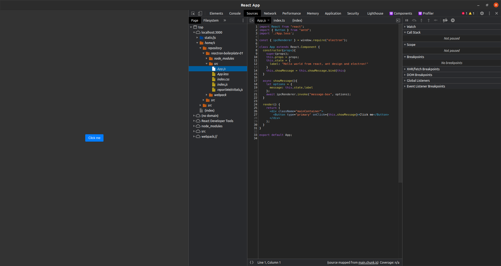

# Reactron. Basic react/electron boilerplate

## Features

- Design: [ant design](https://ant.design/)
- [CRACO (Create React App Configuration Override)](https://github.com/gsoft-inc/craco). Used to override the default theme configuaration. See also `craco.config.js`
- [Electron](https://www.electronjs.org/). Used to build cross-platform desktop app
- Configured debugger for both renderer process and main process
- Prevent multiple application instance 

## Installation

```bahs
npm i
```

## Usage

To start electron app launch:
```bash
npm run electron:serve
```

To build app for current os:
```bash
npm run electron:build
```

## Debug

### Main Process

First start only the renderer process throw:

```bash
yarn start
```
Then you can click `Run & Debug` in VS code and add to your launch.json following configuration:

```json
{
  "version": "0.2.0",
  "configurations": [
    {
      "name": "Debug Main Process",
      "type": "node",
      "request": "launch",
      "cwd": "${workspaceFolder}",
      "runtimeExecutable": "${workspaceFolder}/node_modules/.bin/electron",
      "windows": {
        "runtimeExecutable": "${workspaceFolder}/node_modules/.bin/electron.cmd"
      },
      "args" : ["."],
      "outputCapture": "std"
    }
  ]
}
```

### Renderer Process

For debugging the renderer process I used [electron-devtools](https://www.npmjs.com/package/electron-devtools-installer). Every time you launch the application through electron in developer mode, you will find an extension enabled to facilitate debugging with react




